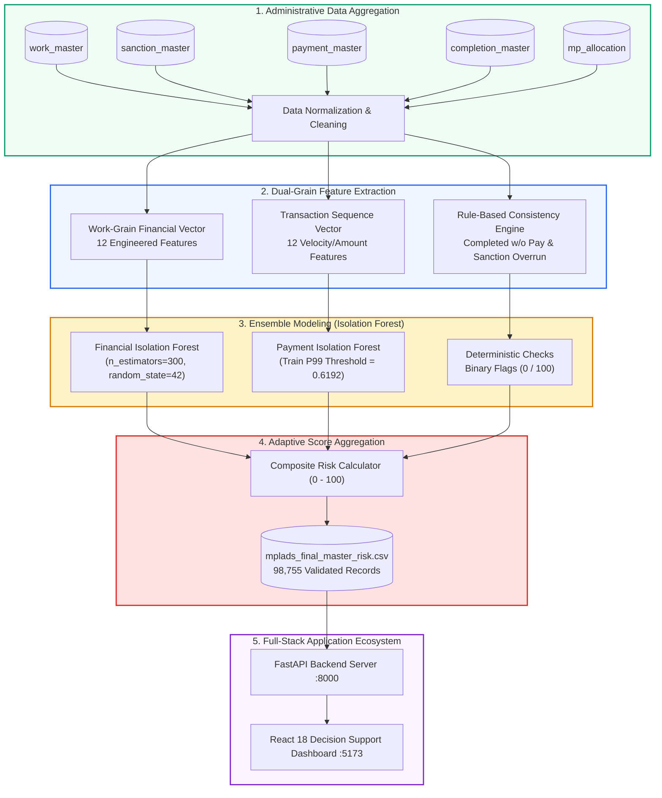

<div align="center">

# 🏛️ MPLADS AI-POWERED ANOMALY MONITORING SYSTEM
### *Next-Generation Intelligent Decision Support & Oversight Platform for Public Infrastructure Governance*

<br/>

[](https://react.dev/)
[](https://vitejs.dev/)
[](https://fastapi.tiangolo.com/)
[](https://scikit-learn.org/)
[](https://www.sqlite.org/)
[](#-national-scope)

<br/>

[🌟 Key Highlights](#-key-capabilities) • [🤖 ML Architecture](#-machine-learning--anomaly-detection-architecture) • [🖥️ Dashboard Tour](#-interactive-portal-walkthrough) • [📡 API Reference](#-backend-api-ecosystem) • [🚀 Quick Launch](#-quick-start--local-deployment)

</div>

---

> [!IMPORTANT]
> ### 🛡️ National Decision Support & Ethical Governance Notice
> **Anomaly and risk scores indicate statistically unusual disbursement patterns, milestone delays, or telemetry discrepancies that warrant administrative review.**
> 
> **They DO NOT constitute proof of financial wrongdoing, fraud, corruption, or misuse of funds.** The platform serves exclusively as an objective decision-support instrument to assist human monitoring officers, district authorities, and national auditors in prioritizing administrative verification.

---

## 🌟 Key Capabilities

```
┌────────────────────────────────────────────────────────────────────────────────────────────────────────┐
│                                   🎯 CORE CAPABILITY HIGHLIGHTS                                       │
├──────────────────────────┬──────────────────────────┬──────────────────────────┬───────────────────────┤
│ 📊 98,755 Projects       │ 🎯 5-Tier Color Scale    │ ⚡ Instant State Filter  │ 🔍 Multi-Criteria ML  │
│ Complete national census │ Standardized color tiers │ Instant drill-down in    │ Dual Isolation Forest │
│ across all 36 States &   │ with percentage numbers  │ interactive donut cards  │ + Deterministic Rules │
│ Union Territories.       │ & synchronized bars.     │ with 0ms paint latency.  │ (0-100 scale).        │
└──────────────────────────┴──────────────────────────┴──────────────────────────┴───────────────────────┘
```

<br/>

<table>
  <tr>
    <td width="50%">
      <h3>🔍 Automated Anomaly Discovery</h3>
      <ul>
        <li><b>Financial Variance Triage</b>: Detects significant mismatches between sanctioned allocations and multi-stage disbursements.</li>
        <li><b>Payment Velocity & Sequences</b>: Flags irregular interval releases and abnormal vendor accumulation patterns.</li>
        <li><b>Execution Consistency Engine</b>: Automatically identifies projects completed without payment records or exceeding approved sanction ceilings.</li>
      </ul>
    </td>
    <td width="50%">
      <h3>💼 High-Density Decision Portal</h3>
      <ul>
        <li><b>Interactive Scope Filtering</b>: Instant state-by-state slice in the national risk donut chart.</li>
        <li><b>Actionable Priority Queue</b>: 1-click audit workflows (<i>Request Field Inquiry</i>, <i>Mark Reviewed</i>).</li>
        <li><b>Temporal Fiscal Analytics</b>: Tracks multi-year risk trajectories across 2023–2027 fiscal periods.</li>
      </ul>
    </td>
  </tr>
</table>

---

## 🎨 Standardized 5-Tier Color Coding Standard

Every risk score, percentage number, badge, and progress bar across all modules adheres to this unified color-coded taxonomy:

| Score Range | Color Tone | Hex Code | Visual Indicator | Official Classification | Operational Action |
| :---: | :---: | :---: | :---: | :---: | :--- |
| **`0 – 20`** | **Green** | `#059669` | `🟢 [██░░░░░░░░]` | **Low Risk** | Routine administrative record; regular tracking |
| **`20 – 40`** | **Greenish-Yellow** | `#84CC16` | `🟡 [████░░░░░░]` | **Low-Moderate** | Standard monitoring; normal baseline variance |
| **`40 – 60`** | **Orange** | `#F97316` | `🟠 [██████░░░░]` | **Moderate Risk** | Advisory observation; monitor subsequent releases |
| **`60 – 80`** | **Light Red** | `#EF4444` | `🔴 [████████░░]` | **High Risk** | **Administrative Review Required** |
| **`80 – 100`** | **Dark Red** | `#991B1B` | `🟣 [██████████]` | **Critical Risk** | **Priority Review / Field Inquiry Mandated** |

---

## 🤖 Machine Learning & Anomaly Detection Architecture



<br/>

<details open>
<summary><b>📐 Component 1: Work-Grain Financial Risk Model (Click to expand)</b></summary>
<br/>

- **Algorithm**: `IsolationForest` (300 Isolation Trees)
- **Training Period**: Fiscal Years `2023–24`, `2024–25`, `2025–26` | **Test Period**: `2026–27`
- **12 Mathematical Features**:
  1. `sanction_amount`: Approved budgetary ceiling.
  2. `total_disbursed_amount`: Sum of released funds across all installments.
  3. `payment_count`: Transaction frequency.
  4. `in_progress_payment_count`: Active incomplete disbursements.
  5. `in_progress_payment_amount`: Cumulative funds in pending installments.
  6. `payment_to_sanction_ratio`: Relative disbursement ratio ($\frac{\text{Disbursed}}{\text{Sanction}}$).
  7. `payment_minus_sanction_amount`: Absolute monetary variance ($\text{Disbursed} - \text{Sanction}$).
  8. `average_payment_amount`: Mean value per installment tranche.
  9. `maximum_payment_amount`: Peak single tranche amount.
  10. `minimum_payment_amount`: Minimum single tranche amount.
  11. `payment_amount_std`: Standard deviation of installment sizes.
  12. `payment_duration_days`: Calendar span from first to final release.

</details>

<br/>

<details>
<summary><b>⚡ Component 2: Transaction-Grain Payment Anomaly Model (Click to expand)</b></summary>
<br/>

- **Algorithm**: Sequence & Velocity `IsolationForest`
- **Training Dataset**: **100,603** historical payment transactions | **Test Set**: **8,631** transactions
- **Decision Threshold**: Training P99 benchmark (`0.6191985`)
- **Stability**: Confirmed invariant across 5 independent random seeds (≥4/5 seed stability = **91.6%**).
- **12 Velocity Features**:
  1. `fund_disbursed_amount`: Current tranche magnitude.
  2. `sanction_amount`: Baseline work approval limit.
  3. `payment_sequence_number`: Position in installment chain ($1, 2, \dots, n$).
  4. `days_since_previous_payment`: Velocity gap between consecutive tranches.
  5. `days_since_sanction`: Calendar lag from sanction to payment.
  6. `prior_disbursed_amount`: Total funds released prior to current tranche.
  7. `prior_vendor_count`: Number of historical vendors engaged on this project.
  8. `payment_share_of_prior_disbursed_amount`: Proportional ratio of current tranche.
  9. `vendor_previous_payment_count`: Lifetime transaction volume with this specific vendor.
  10. `vendor_previous_work_count`: Number of projects assigned to this vendor.
  11. `vendor_previous_total_amount`: Cumulative historical earnings of this vendor.
  12. `is_success`: Binary completion status.

</details>

<br/>

<details>
<summary><b>⚖️ Component 3: Adaptive Multi-Criteria Score Synthesis (Click to expand)</b></summary>
<br/>

The composite risk score dynamically adjusts based on payment transaction telemetry availability:

$$\text{Final Risk Score} = \begin{cases} 
0.50 \cdot \text{FinRisk} + 0.30 \cdot \text{PayRisk} + 0.20 \cdot \text{ExecRisk} & \text{when payment telemetry is available} \\
0.625 \cdot \text{FinRisk} + 0.375 \cdot \text{ExecRisk} & \text{when payment telemetry is missing}
\end{cases}$$

</details>

---

## 🖥️ Interactive Portal Walkthrough

```
┌────────────────────────────────────────────────────────────────────────────────────────────────────────┐
│                                   🌐 WEB APPLICATION NAVIGATION TABS                                  │
└────────────────────────────────────────────────────────────────────────────────────────────────────────┘
```

<table>
  <tr>
    <td width="33%" align="center">
      <h4>📊 Tab 1: Dashboard</h4>
      <p>National summary KPIs, interactive state-level risk donut chart with inline dropdown selector, top states bar chart, score index key, and highest-risk preview table.</p>
    </td>
    <td width="33%" align="center">
      <h4>📂 Tab 2: All Works</h4>
      <p>Full 98,755-project database register with multi-parameter filtering (State, FY, Category, Risk, Priority), instant search, and inline mini color progress bars.</p>
    </td>
    <td width="33%" align="center">
      <h4>⚠️ Tab 3: Priority Review</h4>
      <p>Dedicated audit triage queue equipped with quick-filter chips (<i>All Requiring Review</i>, <i>High Risk</i>, <i>High Priority</i>, <i>Execution Issues</i>, <i>Payment Anomalies</i>).</p>
    </td>
  </tr>
  <tr>
    <td width="33%" align="center">
      <h4>🗺️ Tab 4: State Wise Analysis</h4>
      <p>36 States & UTs risk overview matrix, individual state risk distributions, workload comparisons, and prioritized state work inspection.</p>
    </td>
    <td width="33%" align="center">
      <h4>📅 Tab 5: Financial Year</h4>
      <p>Longitudinal fiscal trends across financial years, review demand growth, mean anomaly trajectory curves, and annual statistical matrix.</p>
    </td>
    <td width="33%" align="center">
      <h4>🔍 Inspection Modal</h4>
      <p>Deep-dive single work modal: sanction vs. disbursement ratios, payment verification signals, execution consistency checks, and audit action buttons.</p>
    </td>
  </tr>
</table>

---

## 📡 Backend API Ecosystem

The FastAPI server provides high-performance asynchronous endpoints with composite database indexing:

<details open>
<summary><b>📋 Core REST API Endpoints</b></summary>
<br/>

| Method | Endpoint | Description | Query Parameters |
| :--- | :--- | :--- | :--- |
| `GET` | `/api/summary` | National KPI metrics, review counts, risk distributions | — |
| `GET` | `/api/works` | Paginated, filterable, sortable master project list | `page`, `page_size`, `state`, `financial_year`, `risk_level`, `search`, `sort_by` |
| `GET` | `/api/works/{work_id}` | Deep inspection metadata and audit flags for a single work | `work_id` |
| `GET` | `/api/high-risk` | Priority review queue sorted descending by risk score | `page`, `page_size`, `state` |
| `GET` | `/api/states` | 36 States & UTs aggregated workload, review count, and avg risk | — |
| `GET` | `/api/financial-years` | Annual multi-year trends, counts, and risk trajectories | — |
| `GET` | `/api/filters` | Distinct dynamic dropdown options | — |
| `GET` | `/api/risk-distribution` | State-level or national risk distribution metrics | `state` |

</details>

---

## 🚀 Quick Start & Local Deployment

### 📋 Prerequisites
- **Python**: `3.10` or higher
- **Node.js**: `18.x` or higher
- **npm**: `9.x` or higher

```bash
# 1. Clone the repository
git clone https://github.com/SSH26-TT/MPLADS-AI-Anomaly-Monitoring.git
cd MPLADS-AI-Anomaly-Monitoring
```

### 🐍 2. Backend Setup
```bash
# Create and activate virtual environment
python -m venv venv

# On Windows:
venv\Scripts\activate
# On Linux / macOS:
source venv/bin/activate

# Install dependencies
pip install -r backend/requirements.txt

# Import and validate precomputed dataset (98,755 projects)
python backend/scripts/import_data.py

# Launch FastAPI development server
uvicorn backend.app.main:app --host 0.0.0.0 --port 8000 --reload
```
> 📖 Interactive Swagger API Docs: `http://localhost:8000/docs`

### ⚡ 3. Frontend Setup
```bash
# Open a new terminal and navigate to frontend
cd frontend

# Install Node dependencies
npm install

# Start Vite dev server (accessible across local network)
npm run dev -- --host 0.0.0.0 --port 5173
```
> 🌐 Dashboard Web App: `http://localhost:5173/`

---

## 📁 Repository Structure

```
MPLADS-AI-Anomaly-Monitoring/
├── 📂 "Data & Models"/
│   ├── 📄 mplads_final_master_risk.csv    # Master precomputed dataset (98,755 records)
│   ├── 📄 work_master.csv                 # Core administrative project registry
│   ├── 📄 sanction_master.csv             # Sanction approval amounts & dates
│   ├── 📄 payment_master.csv              # Multi-installment disbursement logs
│   ├── 📄 completion_master.csv           # Physical completion records
│   ├── 📄 mp_master.csv                   # Parliamentary representative profiles
│   ├── 📄 mp_allocation_master.csv        # Constituency allocation limits
│   ├── 📄 recommendation_master.csv       # MP work recommendations
│   ├── 📄 calamity_consent_master.csv     # Calamity relief authorizations
│   ├── 📄 isolation_forest_model.pkl      # Trained Work-grain Financial model
│   ├── 📄 payment_anomaly_model.pkl       # Trained Transaction-grain Payment model
│   ├── 📄 payment_anomaly_imputer.pkl     # Payment feature imputer artifact
│   ├── 📄 risk_engine_metadata.json       # Frozen risk engine configuration
│   ├── 📄 model_metadata.json             # Financial Isolation Forest specs
│   ├── 📄 payment_anomaly_metadata.json   # Payment Isolation Forest specs
│   ├── 📄 model_features.json             # 12 Financial feature definitions
│   ├── 📄 payment_anomaly_features.json   # 12 Payment feature definitions
│   ├── 📄 risk_thresholds.json            # Classification cutoff thresholds
│   └── 📄 payment_anomaly_thresholds.json # Transaction anomaly thresholds
├── 📂 backend/
│   ├── 📂 app/
│   │   ├── 📂 models/           # SQLAlchemy ORM models (MPLADSProject)
│   │   ├── 📂 routers/          # FastAPI sub-routers (summary, works, analytics, filters)
│   │   ├── 📂 schemas/          # Pydantic validation schemas
│   │   ├── 📄 database.py       # Engine setup (SQLite / PostgreSQL)
│   │   └── 📄 main.py           # Application entrypoint & CORS middleware
│   ├── 📂 scripts/
│   │   └── 📄 import_data.py    # High-speed batch CSV import & validation script
│   ├── 📄 requirements.txt      # Python dependencies
│   └── 📄 .env.example          # Environment configuration template
├── 📂 frontend/
│   ├── 📂 src/
│   │   ├── 📂 components/       # Modals, ScoreLegend, StatCard, Badges, Header, Sidebar
│   │   ├── 📂 pages/            # Dashboard, All Works, Priority Review, State & FY Analytics
│   │   ├── 📂 services/         # Axios API client
│   │   ├── 📂 utils/            # 5-tier color scale & formatting utilities
│   │   ├── 📂 types/            # TypeScript data contracts
│   │   ├── 📄 App.tsx           # Main application shell & routing
│   │   └── 📄 index.css         # Modern design tokens, utilities & responsive styles
│   ├── 📄 package.json          # Node dependencies
│   └── 📄 vite.config.ts        # Vite configuration
├── 📄 .gitignore                # Git exclusions
└── 📄 README.md                 # Project documentation
```

---

<div align="center">

### 🏛️ MPLADS AI Decision Support System
*Dedicated to Transparent Public Infrastructure Governance, Efficient Administrative Oversight, and Objective Risk Prioritization.*

</div>
