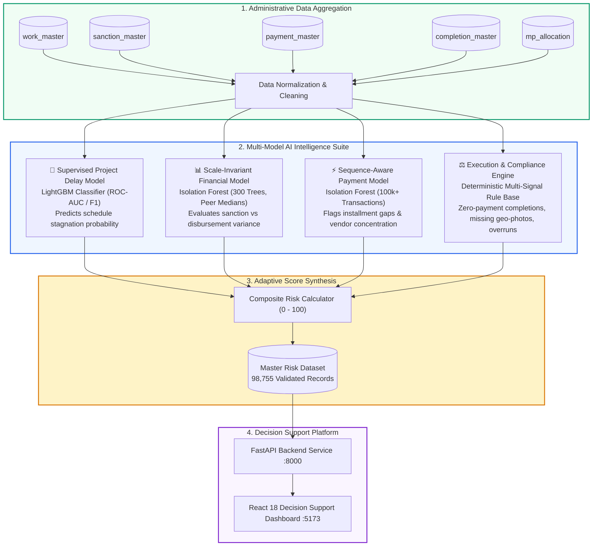

<div align="center">

# 🏛️ MPLADS AI-POWERED ANOMALY MONITORING SYSTEM
### *Next-Generation Intelligent Decision Support & Oversight Platform for Public Infrastructure Governance*

<br/>

[](http://13.203.136.117/)
[](http://13.203.136.117/docs)
[](http://13.203.136.117/health)
[](https://react.dev/)
[](https://fastapi.tiangolo.com/)
[](https://scikit-learn.org/)
[](https://www.sqlite.org/)
[](#-the-rising-challenge--our-ai-solution)

<br/>

### 🌐 **Live Cloud Deployment (Active on AWS)**

<p align="center">
  🖥️ <b>Live Web Dashboard:</b> <a href="http://13.203.136.117/"><code>http://13.203.136.117/</code></a><br/>
  ⚡ <b>Backend REST API:</b> <a href="http://13.203.136.117/api/summary"><code>http://13.203.136.117/api/summary</code></a><br/>
  📖 <b>Interactive Swagger API Docs:</b> <a href="http://13.203.136.117/docs"><code>http://13.203.136.117/docs</code></a><br/>
  🩺 <b>Live Health Check:</b> <a href="http://13.203.136.117/health"><code>http://13.203.136.117/health</code></a>
</p>

<br/>

<p align="center">
  <a href="#-key-capabilities">🌟 Key Highlights</a> • 
  <a href="#-multi-model-ai--anomaly-detection-architecture">🤖 Multi-Model AI Suite</a> • 
  <a href="#-sleek-modern-ui--design-system">🎨 Sleek UI & Design</a> • 
  <a href="#-interactive-portal-walkthrough">🖥️ Dashboard Tour</a> • 
  <a href="#-backend-api-ecosystem">📡 API Reference</a> • 
  <a href="#-aws-cloud-deployment-docker-compose">☁️ AWS Deployment</a>
</p>

</div>

---

> [!IMPORTANT]
> ### 🛡️ National Decision Support & Ethical Governance Notice
> **Anomaly and risk scores indicate statistically unusual disbursement patterns, milestone delays, or telemetry discrepancies that warrant administrative review.**
> 
> **They DO NOT constitute proof of financial wrongdoing, fraud, corruption, or misuse of funds.** The platform serves exclusively as an objective decision-support instrument to assist human monitoring officers, district authorities, and national auditors in prioritizing administrative verification.

---

## ⚠️ The Rising Challenge & Our AI Solution

### The Real-World Challenge in Public Infrastructure Oversight
Every year, thousands of vital community projects — from drinking water pipelines and rural roads to schools and healthcare centers — are sanctioned across India under the **Member of Parliament Local Area Development Scheme (MPLADS)**. 

However, monitoring nearly **100,000 active projects** across 36 States and Union Territories creates a severe administrative bottleneck:
- **Massive Data Overload**: Tracking hundreds of thousands of multi-stage disbursements, sanction approvals, and completion reports manually across physical files and static spreadsheets is virtually impossible.
- **Hidden Discrepancies**: Process delays, abnormal payment release velocities, and projects marked physically complete without corresponding payment records often go unnoticed for months.
- **Auditor Bottleneck**: District authorities and national audit teams lack an automated triage tool to tell them **which projects need immediate inspection today**.

---

### 💡 How Our System Solves It Efficiently
The **MPLADS AI Monitor** transforms this massive operational challenge into an instant, automated decision-support platform:

1. **National-Scale Screening in Seconds**: Continuously screens all **98,755 projects nationwide**, turning millions of raw administrative records into actionable intelligence.
2. **Intelligent Triage (From 100,000 to the Critical 2%)**: Instead of inspecting 100,000 files blindly, our multi-criteria AI engine automatically isolates the **2,090 projects (just ~2%)** showing unusual disbursement patterns or milestone delays.
3. **Multi-Model AI Suite**:
   - **Supervised Delay Model (LightGBM)**: Predicts probability of milestone schedule overrun and execution stagnation.
   - **Scale-Invariant Financial Model (Isolation Forest)**: Flags budget variance against category & peer medians.
   - **Sequence-Aware Payment Model (Isolation Forest)**: Detects irregular installment release chronology and vendor accumulation.
   - **Execution & Compliance Engine**: Catches zero-disbursement completions, missing geo-tagged site inspection photos, and sanction limit breaches.
4. **Actionable Governance**: Auditors can instantly filter state-by-state, inspect component breakdown cards, and examine specific site descriptions with a single click.

---

## 🌟 Key Capabilities

```
┌────────────────────────────────────────────────────────────────────────────────────────────────────────┐
│                                   🎯 CORE CAPABILITY HIGHLIGHTS                                       │
├──────────────────────────┬──────────────────────────┬──────────────────────────┬───────────────────────┤
│ 📊 98,755 Projects       │ 🎨 Sleek Gradient UI     │ ⚡ Dynamic State Filter  │ 🔍 Multi-Model AI     │
│ Complete national census │ Obsidian-emerald sidebar │ Instant drill-down in    │ LightGBM Classifier + │
│ across all 36 States &   │ with glassmorphism cards │ interactive donut cards  │ Dual Isolation Forest │
│ Union Territories.       │ & centered data tables.  │ with 0ms paint latency.  │ (0-100 risk scores).  │
└──────────────────────────┴──────────────────────────┴──────────────────────────┴───────────────────────┘
```

<br/>

<table>
  <tr>
    <td width="50%">
      <h3>🔍 Automated Anomaly Discovery</h3>
      <ul>
        <li><b>Supervised Delay Prediction</b>: High-precision gradient boosting model predicting milestone delays before they stall.</li>
        <li><b>Financial Variance Triage</b>: Detects significant mismatches between sanctioned allocations and multi-stage disbursements.</li>
        <li><b>Payment Velocity & Sequences</b>: Flags irregular interval releases and abnormal vendor accumulation patterns.</li>
        <li><b>Execution Compliance Engine</b>: Automatically identifies projects completed without payment records, missing geo-photos, or exceeding approved sanction ceilings.</li>
      </ul>
    </td>
    <td width="50%">
      <h3>💼 High-Density Decision Portal</h3>
      <ul>
        <li><b>Interactive Scope Filtering</b>: Instant state-by-state slice in the national risk donut chart.</li>
        <li><b>Clean Centered Data Hierarchy</b>: All table columns, metrics, and badges are centered for optimal readability.</li>
        <li><b>Non-Intrusive Tooltips</b>: Compact dark glassmorphism hover pills that never clash with chart visuals.</li>
        <li><b>Temporal Fiscal Analytics</b>: Tracks multi-year risk trajectories across 2023–2027 fiscal periods.</li>
      </ul>
    </td>
  </tr>
</table>

---

## 🎨 Sleek Modern UI & Design System

The portal features a **modern gradient & glassmorphism** design crafted specifically for high-density administrative monitoring:

- **Obsidian-Emerald Gradient Sidebar**: Multi-stop gradient (`#021E16` $\rightarrow$ `#063E2F` $\rightarrow$ `#01140E`) with glowing active navigation indicators and official national emblem branding.
- **Glassmorphic Base Cards**: `backdrop-filter: blur(14px)` with subtle elevation shadows and `-3px` interactive hover lift physics.
- **2x2 Side-by-Side Donut Labels**: Balanced ~30px breathing room between center ring and side cards with centered statistics and percentages.
- **SVG Linear Gradients**: Custom `<defs><linearGradient...>` applied across Recharts bar, line, and area charts.
- **Non-Intrusive Tooltips**: Compact, dark glassmorphic hover cards (`#0F172A`, `blur(8px)`) displaying clean metric breakdowns without covering graph bars.
- **Centered Data Tables**: Centered table headers, row data, meters, and glowing status pills with gradient hover illumination.

---

## 🎯 Standardized 5-Tier Risk Classification Scale

Every risk score, percentage number, badge, and progress bar across all modules adheres to a unified color-coded taxonomy:

| Score Range | Tier | Status Tone | Official Classification | Operational Audit Action |
| :---: | :---: | :---: | :---: | :--- |
| **0 – 20%** | `Low` | 🟢 Emerald (`#059669`) | **Low Risk** | Routine administrative record; regular tracking |
| **20 – 40%** | `Low-Mod` | 🟡 Lime-Yellow (`#84CC16`) | **Low-Moderate** | Standard monitoring; normal baseline variance |
| **40 – 60%** | `Medium` | 🟠 Amber (`#F59E0B`) | **Medium Risk** | Advisory observation; monitor subsequent tranche releases |
| **60 – 80%** | `High` | 🔴 Coral-Red (`#EF4444`) | **High Risk** | **Administrative Review Required** |
| **80 – 100%** | `Critical` | 🟣 Ruby-Red (`#991B1B`) | **Very High Risk** | **Priority Review / Field Inquiry Mandated** |

---

## 🤖 Multi-Model AI & Anomaly Detection Architecture



<br/>

<details open>
<summary><b>🤖 Model 1: Supervised Project Delay Classifier (LightGBM) — Click to expand</b></summary>
<br/>

- **Architecture**: Gradient Boosted Decision Tree (`LGBMClassifier`) with class imbalance weighting (`scale_pos_weight`).
- **Core Features**:
  1. `sanction_amount`: Approved budgetary allocation.
  2. `recommendation_to_sanction_days`: Administrative lead time before sanction approval.
  3. `has_payment_recorded`: Binary flag for fund release initiation.
  4. `sanction_to_first_payment_days`: Calendar lag from sanction approval to first tranche release.
  5. `first_payment_amount`: Monetary volume of initial disbursement.
  6. `first_payment_to_sanction_ratio`: Proportional share of initial release against sanction.
  7. Categorical dimensions: `house` (Lok Sabha / Rajya Sabha), `work_category`, `state`, and `first_payment_status`.
- **Output**: Predicts calibrated delay probability score ($0 - 100\%$) for ongoing infrastructure works.

</details>

<br/>

<details>
<summary><b>📊 Model 2: Scale-Invariant Financial Anomaly Model (Isolation Forest) — Click to expand</b></summary>
<br/>

- **Architecture**: High-dimensional `IsolationForest` (300 estimators, peer-normalized feature representations).
- **Core Features**:
  1. Logarithmic scales: `log_sanction`, `log_disbursed`.
  2. Relative ratios: `rel_payment_to_sanction`, `rel_payment_duration`.
  3. Peer median comparative indicators: `rel_sanction_vs_peer`, `rel_payment_count_vs_peer`, `rel_disbursed_vs_peer`.
  4. Tranche distribution metrics: `rel_avg_installment`, `rel_max_installment`, `payment_count_clean`, `in_progress_ratio`.
- **Output**: Calibrated Financial Risk Score ($0 - 100\%$) indicating budget allocation anomalies.

</details>

<br/>

<details>
<summary><b>⚡ Model 3: Sequence-Aware Payment Anomaly Model (Isolation Forest) — Click to expand</b></summary>
<br/>

- **Architecture**: Sequential & Velocity `IsolationForest` trained on **100,603+ historical disbursement transactions**.
- **Core Features**:
  1. `log_fund_disbursed`: Monetary magnitude of current installment.
  2. `payment_share_of_sanction`: Tranche proportion relative to approved ceiling.
  3. `days_since_prev_clean`: Velocity gap between consecutive tranches.
  4. `days_since_sanction_clean`: Calendar lag from sanction to payment.
  5. Vendor concentration metrics: `prior_vendor_count_clean`, `vendor_prev_pmt_count`, `vendor_prev_work_count`.
  6. Milestone execution state: `is_first_payment`, `is_success_clean`.
- **Output**: Calibrated Transaction Risk Score ($0 - 100\%$) isolating irregular payment sequences.

</details>

<br/>

<details>
<summary><b>⚖️ Engine 4: Physical Execution & Milestone Compliance Engine — Click to expand</b></summary>
<br/>

- **Mechanism**: Deterministic rule-based governance checks evaluating physical milestones against telemetry:
  1. **Zero-Payment Completion**: Work marked physically completed with 0 recorded disbursement vouchers (Score = 100).
  2. **Missing Geo-Tagged Inspection**: Completed work missing mandatory geo-tagged physical site photos (`image_indicator = 0`).
  3. **Sanction Limit Overrun**: Cumulative released funds exceeding administrative sanction limits.
  4. **Extended Milestone Stagnation**: Projects where execution duration significantly exceeds national peer benchmarks.

</details>

---

## 🖥️ Interactive Portal Walkthrough

<table>
  <tr>
    <td width="25%" align="center">
      <h4>📊 Tab 1: Dashboard</h4>
      <p>National summary KPIs, 4-tier risk banner cards, interactive state-level risk donut chart with inline dropdown selector, top states bar chart, and recent works table.</p>
    </td>
    <td width="25%" align="center">
      <h4>📂 Tab 2: All Works</h4>
      <p>Full 98,755-project registry with multi-parameter filtering (State, FY, Category, Risk, Priority, Payment Data), instant search, center-aligned table, and glowing pill badges.</p>
    </td>
    <td width="25%" align="center">
      <h4>🗺️ Tab 3: State Wise Analysis</h4>
      <p>36 States & UTs risk overview, state selector with volume ranking, individual state risk distribution, workload comparison chart, and prioritized state work inspection.</p>
    </td>
    <td width="25%" align="center">
      <h4>📅 Tab 4: Financial Year</h4>
      <p>Longitudinal fiscal trends across financial years, review demand growth, mean anomaly trajectory curves, and annual statistical matrix.</p>
    </td>
  </tr>
</table>

<br/>

<div align="center">
  <h4>🔍 Deep Inspection Work Modal</h4>
  <p>Detailed project dossier: sanction vs. disbursement amounts, specific site and location scope descriptions, 5-dimension risk breakdown meters, and structured administrative audit observations.</p>
</div>

---

## 📡 Backend API Ecosystem

The FastAPI server provides high-performance asynchronous endpoints with composite database indexing:

| Method | Endpoint | Description | Query Parameters |
| :--- | :--- | :--- | :--- |
| `GET` | `/api/summary` | National KPI metrics, review counts, risk distributions | — |
| `GET` | `/api/works` | Paginated, filterable, sortable master project list | `page`, `page_size`, `state`, `financial_year`, `risk_level`, `investigation_priority`, `payment_data_available`, `search`, `sort_by`, `sort_order` |
| `GET` | `/api/works/{work_id}` | Deep inspection metadata and audit flags for a single work | `work_id` |
| `GET` | `/api/states` | 36 States & UTs aggregated workload, review count, and avg risk | — |
| `GET` | `/api/financial-years` | Annual multi-year trends, counts, and risk trajectories | — |
| `GET` | `/api/filters` | Distinct dynamic dropdown options | — |
| `GET` | `/api/risk-distribution` | State-level or national risk distribution metrics | `state` |

---

## 🚀 Quick Start & Local Deployment

### 📋 Prerequisites
- **Python**: `3.10` or higher
- **Node.js**: `18.x` or higher
- **npm**: `9.x` or higher

```bash
# 1. Clone the repository
git clone https://github.com/Sankhyaan/MPLADS-AI-Anomaly-Monitoring.git
cd MPLADS-AI-Anomaly-Monitoring
```

### 🐍 2. Backend Setup
```bash
# Create and activate virtual environment
python -m venv venv

# On Windows:
venv\Scripts\activate
# On Linux / macOS:
source venv/bin/activate

# Install dependencies
pip install -r backend/requirements.txt

# Import and validate precomputed dataset (98,755 projects)
python backend/scripts/import_data.py

# Launch FastAPI development server
uvicorn backend.app.main:app --host 0.0.0.0 --port 8000 --reload
```
> 📖 Interactive Swagger API Docs: `http://localhost:8000/docs`

### ⚡ 3. Frontend Setup
```bash
# Open a new terminal and navigate to frontend
cd frontend

# Install Node dependencies
npm install

# Start Vite dev server
npm run dev -- --host 0.0.0.0 --port 5173
```
> 🌐 Dashboard Web App: `http://localhost:5173/`

---

## ☁️ AWS Cloud Deployment (Docker Compose)

The complete application is deployed live on **AWS EC2** using multi-stage Docker container orchestration with an Nginx reverse proxy.

### 🚀 Live Endpoints:
* **Web Portal**: [http://13.203.136.117/](http://13.203.136.117/)
* **Interactive Swagger API**: [http://13.203.136.117/docs](http://13.203.136.117/docs)
* **Backend Health**: [http://13.203.136.117/health](http://13.203.136.117/health)

### 🛠️ One-Command AWS Launch:
```bash
# 1. SSH into Ubuntu EC2 instance
ssh -i "your-key.pem" ubuntu@<YOUR-EC2-IP>

# 2. Clone repository & build
git clone https://github.com/Sankhyaan/MPLADS-AI-Anomaly-Monitoring.git
cd MPLADS-AI-Anomaly-Monitoring
docker compose up -d --build
```
> 📄 Detailed guide available in [AWS_DEPLOYMENT_GUIDE.md](./AWS_DEPLOYMENT_GUIDE.md).

---

## ☁️ Alternative Cloud Options (Render + Vercel)

* **Backend**: Push `backend/` to [Render.com](https://render.com) using [render.yaml](./render.yaml).
* **Frontend**: Deploy `frontend/` to [Vercel.com](https://vercel.com) using [vercel.json](./frontend/vercel.json) with `VITE_API_URL` set to your backend service.

---

## 📁 Clean Repository Structure

```
MPLADS-AI-Anomaly-Monitoring/
├── 📂 Data & Models/
│   ├── mplads_final_master_risk.csv
│   ├── isolation_forest_model.pkl
│   ├── payment_anomaly_model.pkl
│   ├── delay_model.pkl
│   └── *.json (model metadata & thresholds)
├── 📂 Notebooks/
│   ├── Isolation_Forest/
│   └── Execution & Risk_Score/
├── 📂 backend/
│   ├── app/
│   │   ├── models/
│   │   ├── routers/
│   │   ├── schemas/
│   │   ├── database.py
│   │   └── main.py
│   ├── scripts/
│   │   └── import_data.py
│   ├── Dockerfile
│   └── requirements.txt
├── 📂 frontend/
│   ├── public/
│   ├── src/
│   │   ├── components/
│   │   ├── pages/
│   │   ├── services/
│   │   ├── utils/
│   │   ├── types/
│   │   ├── App.tsx
│   │   └── index.css
│   ├── Dockerfile
│   ├── nginx.conf
│   ├── vercel.json
│   └── package.json
├── docker-compose.yml
├── AWS_DEPLOYMENT_GUIDE.md
├── render.yaml
├── .gitignore
└── README.md
```

---

<div align="center">

### 🏛️ MPLADS AI Decision Support System
*Dedicated to Transparent Public Infrastructure Governance, Efficient Administrative Oversight, and Objective Risk Prioritization.*

</div>
